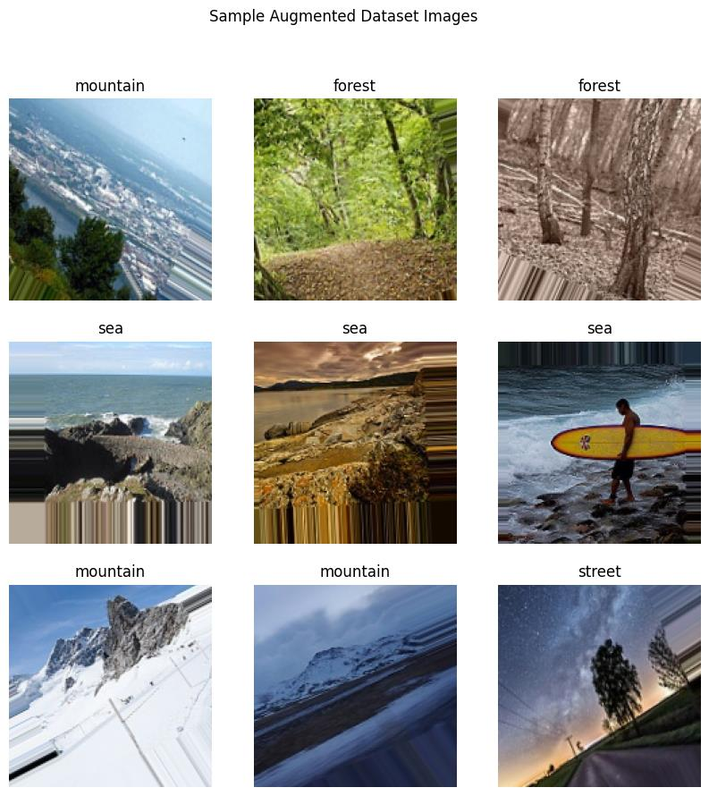
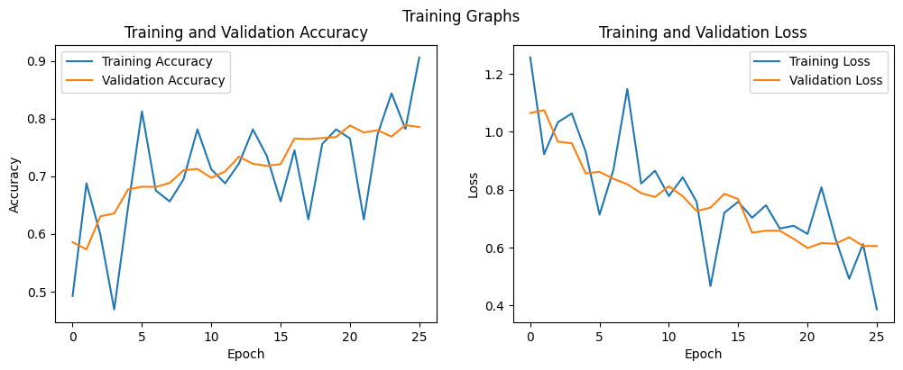
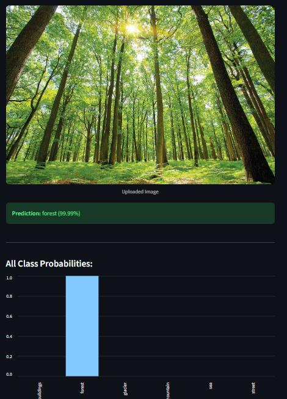
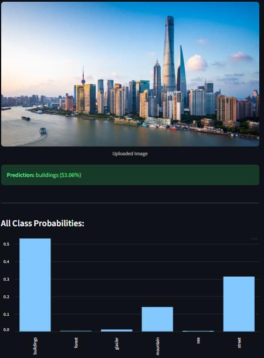

# 🏞️ Natural Scene Classifier

A custom Convolutional Neural Network — **built and trained from scratch, no pretrained backbone** — that classifies natural scene photos into six categories: *buildings, forest, glacier, mountain, sea, street*. Deployed as an interactive Streamlit app.

**81.03% test accuracy** on 3,000 held-out images · trained on the [Intel Image Classification](https://www.kaggle.com/datasets/puneet6060/intel-image-classification) dataset (~25,000 images, 150×150 RGB)

>> 🔗 **Live demo:** [scenery-classifier.streamlit.app](https://scenery-classifier.streamlit.app)

---

## Overview

Most "image classifier" portfolio projects reach for a pretrained backbone (ResNet, EfficientNet, etc.) and fine-tune the last layer. This project deliberately does the opposite: the constraint was **no transfer learning**, so every convolutional filter here was learned from scratch on this dataset alone. That constraint is what makes the engineering — architecture depth, regularization, and training-time management — the actual point of the project.

| | |
|---|---|
| **Task** | 6-class image classification |
| **Architecture** | Custom 4-block CNN (Conv2D + MaxPooling ×4 → Dense → Dropout → Softmax) |
| **Parameters** | 11,008,838 (~42 MB as weights) |
| **Framework** | TensorFlow 2.x / Keras, trained on Google Colab (T4 GPU) |
| **Test accuracy** | 81.03% |
| **Test loss** | 0.5469 |
| **Deployment** | Streamlit |

## Dataset

~25,000 natural scene images (150×150, RGB) across 6 balanced classes, split into train / validation (via an 80/20 split on the training folder) / test.



Training images went through on-the-fly augmentation (rotation, width/height shift, shear, zoom, horizontal flip) via Keras' `ImageDataGenerator` — the validation and test sets were **not** augmented, only rescaled, so the reported accuracy reflects performance on clean, unseen images.

## Model architecture

```
Input (150, 150, 3)
 → Conv2D(32, 3x3, relu)  → MaxPooling2D
 → Conv2D(64, 3x3, relu)  → MaxPooling2D
 → Conv2D(128, 3x3, relu) → MaxPooling2D
 → Conv2D(256, 3x3, relu) → MaxPooling2D
 → Flatten
 → Dense(512, relu)
 → Dropout(0.5)
 → Dense(6, softmax)
```

Filter counts progressively double (32 → 64 → 128 → 256) so early layers learn simple features (edges, color gradients) and deeper layers learn complex, class-specific texture (tree canopy, building facades, glacial ice).

## Training

| Hyperparameter | Value | Why |
|---|---|---|
| Optimizer | Adam | Adaptive per-parameter learning rates, robust default |
| Learning rate | 0.0001 | Smaller than the Adam default — more stable steps on an augmented, noisy dataset |
| Loss | categorical_crossentropy | Standard for multi-class, one-hot labels |
| Batch size | 32 | |
| Max epochs | 50 | |
| Actual epochs run | 26 (stopped by `EarlyStopping`) | |
| Best epoch | 21 | Weights restored automatically |

**Two callbacks did the heavy lifting:**
- `ModelCheckpoint(monitor='val_accuracy', save_best_only=True)` — only ever saves the epoch with the best validation accuracy, not just the last one.
- `EarlyStopping(monitor='val_loss', patience=5, restore_best_weights=True)` — stopped training once validation loss hadn't improved for 5 straight epochs, restored the best weights, and saved ~24 epochs of unnecessary GPU time.



The spiky (rather than smooth) training accuracy curve is expected — it's a direct visual signature of aggressive data augmentation: the model rarely sees the same image twice, so per-batch accuracy swings a lot even as the underlying trend (and the much smoother validation curve) climbs steadily.

## Results

```
--- DETAILED CLASSIFICATION REPORT ---
              precision    recall  f1-score   support

   buildings       0.71      0.86      0.77       437
      forest       0.91      0.98      0.94       474
     glacier       0.88      0.67      0.76       553
    mountain       0.77      0.79      0.78       525
         sea       0.79      0.85      0.82       510
      street       0.88      0.78      0.83       501

    accuracy                           0.82      3000
   macro avg       0.82      0.82      0.82      3000
weighted avg       0.82      0.82      0.82      3000
```

**Forest** is the easiest class (0.94 F1) — dense green texture is fairly unambiguous. **Glacier** is the hardest (0.67 recall) — it's most often confused with mountain, which makes sense: a snow-capped mountain and a glacier from a distance share a lot of visual structure. That's a dataset-level ambiguity, not a model failure — see [Future Improvements](#future-improvements).

## Real-world testing

The classifier was tested on photos it had never seen from any distribution close to the training set (not from Kaggle at all):

<p>
  
</p>

<p>
  
</p>

Worth noting: the **buildings** prediction above sits at 53% confidence with meaningful probability mass on "street" too — a city skyline genuinely straddles both classes, and the model's uncertainty here is honest calibration, not a bug.

## Project structure

```
scenery-classification-app/
├── app.py                                  # Streamlit inference app
├── requirements.txt
├── models/
│   └── natural_scenes_BEST_model.keras     # trained weights (42 MB)
├── notebook/
│   └── training_notebook.ipynb             # full training run, outputs included
├── assets/                                 # images used in this README
└── README.md
```

## Running locally

```bash
git clone https://github.com/alwin-1107/scenery-classification-app.git
cd scenery-classification-app
pip install -r requirements.txt
streamlit run app.py
```

Then open the local URL Streamlit prints (usually `http://localhost:8501`) and upload a photo.

## Deployment

The trained model is saved in the native **Keras 3 `.keras` format** (not the legacy `.h5` format it was originally checkpointed in) specifically so it fits inside GitHub's 100 MB per-file push limit without needing Git LFS — the `.h5` checkpoint (which also carries Adam optimizer state) was 126 MB; the `.keras` weights-only export is 42 MB, with byte-identical prediction outputs verified against the original.

To get a live public demo link (recommended — a working link is worth more to a recruiter than a repo alone):
1. Push this repo to GitHub.
2. Go to [share.streamlit.io](https://share.streamlit.io), sign in with GitHub, and deploy directly from the repo — Streamlit Community Cloud builds from `requirements.txt` and `app.py` automatically, free tier.
3. Paste the resulting URL into the demo link at the top of this README.

## Challenges & design decisions

**Accuracy vs. training time.** A deeper 4-block CNN on 14,000+ augmented images took over 20 minutes per full run on a T4 GPU. Getting to 81% required accepting that cost rather than cutting corners on depth or dataset size.

**Preventing overfitting.** An 11M-parameter model can easily memorize 14,000 training images (which would show up as ~99% training accuracy but poor test accuracy). Three defenses were combined: aggressive data augmentation (the model rarely sees the same image twice), `Dropout(0.5)` before the output layer, and `EarlyStopping` to cut training off before the validation loss started rising.

## Future improvements

- **Systematic hyperparameter tuning** (KerasTuner / grid search) over learning rate, dropout rate, and optimizer choice — current values follow strong conventions but weren't exhaustively searched.
- **Targeted error analysis on glacier/mountain confusion** — manually reviewing the misclassified images would likely show the model needs more close-up (vs. wide-landscape) glacier examples.
- **Transfer learning**, if the "from scratch" constraint were lifted — fine-tuning a model like EfficientNetV2 or ResNet50 on these 6 classes would very likely push accuracy past 95%, in a fraction of the training time. Left out here specifically *because* training a competitive CNN from scratch was the point of the exercise.

## Tech stack

`Python` · `TensorFlow / Keras` · `NumPy` · `Streamlit` · `Matplotlib` · trained on `Google Colab (T4 GPU)`

## License

MIT — see [LICENSE](LICENSE).
